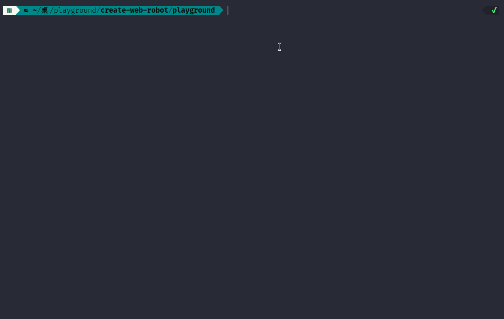

# Create-Webrobot

this is a command about created [webrobot](https://github.com/webgjc/web_robot) sourcecode config



```sh
npm i -g @twoke/create-webrobot
```

```sh
pnpm add -g @twoke/create-webrobot
```

```sh
yarn add -g @twoke/create-webrobot
```

```sh
create-webrobot  -h
```

> -n,--name <char>            脚本名
> -su,--sourceCodeUrl <char>  脚本作用于网页地址 (default: "*")
> -cu,--controlUrl <char>     控制地址 (default: "")
> -si,--startInject           是否网页打开时注入脚本 (default: false)
> -s,--source <char>          webrobot入口文件 (default: "index.js")
> -g,--generate               是否生产json事务配置 (default: false)
> -h, --help                  display help for command
